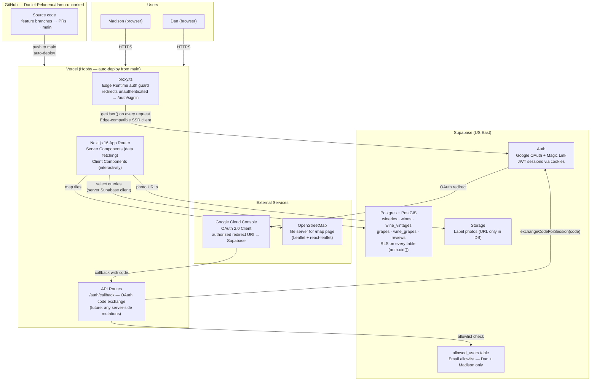

# DamnUncorked — Architecture

```mermaid
graph TD
  subgraph Users["Users"]
    Dan["Dan (browser)"]
    Madison["Madison (browser)"]
  end

  subgraph GitHub["GitHub — Daniel-Peladeau/damn-uncorked"]
    Repo["Source code\nfeature branches → PRs → main"]
  end

  subgraph Vercel["Vercel (Hobby — auto-deploy from main)"]
    Proxy["proxy.ts\nEdge Runtime auth guard\nredirects unauthenticated → /auth/signin"]
    RSC["Next.js 16 App Router\nServer Components (data fetching)\nClient Components (interactivity)"]
    API["API Routes\n/auth/callback — OAuth code exchange\n(future: any server-side mutations)"]
  end

  subgraph Supabase["Supabase (US East)"]
    Auth["Auth\nGoogle OAuth + Magic Link\nJWT sessions via cookies"]
    Allowlist["allowed_users table\nEmail allowlist — Dan + Madison only"]
    DB["Postgres + PostGIS\nwineries · wines · wine_vintages\ngrapes · wine_grapes · reviews\nRLS on every table (auth.uid())"]
    Storage["Storage\nLabel photos (URL only in DB)"]
  end

  subgraph External["External Services"]
    Google["Google Cloud Console\nOAuth 2.0 Client\nauthorized redirect URI → Supabase"]
    OSM["OpenStreetMap\ntile server for /map page\n(Leaflet + react-leaflet)"]
  end

  Dan -- HTTPS --> Vercel
  Madison -- HTTPS --> Vercel

  Repo -- "push to main\nauto-deploy" --> Vercel

  Proxy -- "getUser() on every request\nEdge-compatible SSR client" --> Auth
  RSC -- "select queries\n(server Supabase client)" --> DB
  RSC -- "photo URLs" --> Storage
  API -- "exchangeCodeForSession(code)" --> Auth
  API -- "allowlist check" --> Allowlist

  Auth -- "OAuth redirect" --> Google
  Google -- "callback with code" --> API

  RSC -- "map tiles" --> OSM
```
